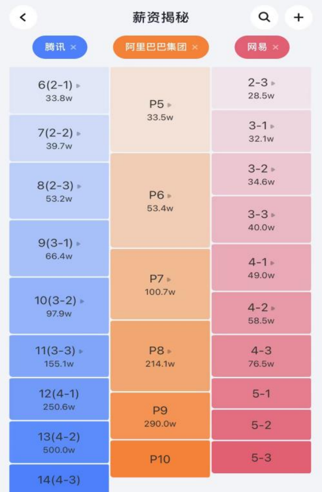

[原文章連接](https://docs.qq.com/doc/DY25paWJ1ZUtaZWhL)

`十一、HR面試常見問題/`

# HR面试技巧——头部大厂 HR 访谈

HR面试一定会问的问题：你的优点与缺点有哪些？你跳槽的原因是什么？过往工作取得的哪些成果？过往工作遇到的困难你是怎么解决的？你的职业规划是什么？薪酬期望是多 少？你还有什么想问我的吗？这些问题本章都会谈到，除此之外，本章还介绍了求职者极可 能感兴趣的坊间秘密：面试的全流程到底是怎样的？找谁帮我们内推更容易通过面试？多久 跳槽一次算作频繁？「毕业季」跳槽应选择什么样的公司？招聘系统是否限制同一个人短时间内频繁多次面试不同的招聘岗位？有哪些谈薪技巧？行业职级对标与薪酬水平？

## 面试的全流程一不要以为通过技术 & HR面试就能拿 Offer

面试一般分为四个阶段：
第一阶段为技术面试阶段，该阶段有3到4轮，主要考察八股文、算法题、设计题、项 目等，如果是外企可能还包含口语面试。

第二阶段为HR面试阶段，关注求职者的入职意愿、沟通能力，团队协作等。国内不同互联网大厂的HR面试有很大的区别，有的具有一票否决权（阿里巴巴），有的只是记录谈 话的关键信息，不对求职者的个人能力和价值做过多判断（字节跳动），HR面试高频问题如下：

- 职业规划是什么？
- 为什么要跳槽？
- 你的优点和缺点有哪些？
- 过往工作中遇到的困难你是怎么解决的？
- 过往工作中取得了哪些成果？详细说说。
- 你的薪酬预期是多少？

第三阶段为Offer审批阶段，HR将求职者的面试评价提交给不同的人进行审批，根据 求职者的面试评价、未来成长潜力来与其他人进行横向与纵向对比，此刻，关键人物依然对
求职者具有一票否决权。

第四阶段为谈薪阶段，提交过去六个月或一年工资流水，根据求职者的过往绩效、面试 评价、背景履历、竞品Offer 等综合计算出一个合理的薪酬涨幅，然后向薪酬委员会推荐求 职者薪酬，并同步到求职者的最终结果中。

## 跳槽时找谁内推更容易通过面试

内推有以下4种途径：

1. 团队负责人，团队负责人在脉脉上发布的招聘需求一定是有真实HC（Human Capital，即公司预计招聘员工的一个数量计划）的，可能招聘还比较紧急，面试流程也比较快。如果团队负责人是高P（阿里巴巴P8及以上），则可能对求职者的面试结果有着微妙的影响。

2. 找同学内推，可以了解团队情况、面试进度与结果反馈，甚至可以向你透露你的 面试评价。一旦获知了面试评价，则对后续的谈薪将帮助极大，但是一般公司不允许将面试评价反馈给求职者。

3. HR，HR发布的招聘需求有可能是伪需求，刷关键绩效指标（KPI）用的，向HR提问一般得到的均是官方回答。也有少数HR除外。

4. 猎头，优秀且专业的猎头是很不错的，他（她）可以帮你谈薪、帮你保密简历内容、不乱投简历，但你往往很难判断猎头的专业性。

## 谈薪技巧

合理薪酬一般由以下因素决定：
1. 面试评价、决定职级、决定薪水。
2. 历史绩效与当前薪水，薪酬一般在当前基础上上涨30%~50%。
3. 极具竞争力的竞品Offer。
4. 教育背景与工作履历与当前职位的匹配度。
5. 面试流程里其他求职者与你横向与纵向的对比。
6. 团队人力成本总预算。
7. ……

笔者理解谈薪的过程本质就是消除信息差的过程。HR在面试期间会向求职者了解以上 信息，但是求职者对上述信息基本都是无感知的（除了第2和第3点），求职者和HR之间存在着大量的信息差，因此HR有条件把涨幅40%的Offer试探性地调整到30% 来观察求职者的反应。

求职者应尽可能地通过与HR的沟通、内推人的反馈来获取自己的真实面试评价，面试 评价的关键字信息透露出你的定级，比如「可以承担中等复杂度项目负责人的角色」可能 就是阿里巴巴的P7或者字节跳动的2-2的职级，职级又决定了薪酬区间。做到心中有数才 更容易坚守合理的底线。可以的话，谈薪前拿到竞品Offer以增加谈判筹码。

## 反问环节一怎么提问能加分

无论面试字节跳动、腾讯还是阿里巴巴，面试的最后一定有反问环节一你还有什么想问 的吗？提出让面试官印象深刻的问题是一个加分项，提问题的原则是：问题的提出必须符合 自身的行为逻辑，符合自身定位。建议提问职业发展与个人成长规划、热点技术、目标岗位相关的业务问题等。

## 你的职业规划

HR希望看到：
- 你有清晰的职业规划，知道自己想要什么并坚持着。
- 当前的机会是你深思熟虑后的选择。
- 个人的成长和团队的发展是契合的。
- 对自己的成长是有要求的。

## 为什么要跳槽

个人的差异性太大，但这个问题是求职者在面试前需要思考的。
●HR的考量：处理问题的角度和方式，以及稳定性。

●HR 推敲你的答案：说辞、动作要逻辑闭环，尊重客观事实。

## 你的优点和缺点

笔者最开始特别讨厌回答这类问题，但是几乎每一次HR面试都被要求回答。 

至今，笔者都还没有明白HR的意图是什么，但显然他（她）不需要我对自己优点和缺 点的自吹，所以每次到这里笔者都比较规矩。

当笔者谈到缺点的时候，会说出笔者和HR都认可的一条，比如毕业后记忆力变差了， 会将重要且有截止日期的事情记录在书签里。

当笔者谈到优点的时候，会讲述一件具体的事来进行展现。

## 过往工作中取得的成果

这是HR面试中的高频问题，一般来说，详细讲述一个项目的细节可以体现项目的真实 性。

## 过往工作中遇到的困难是怎么解决的

一种好的回答方式能反映你的成长与未来的潜力。笔者在面试中是这样回答的：

我通过校园招聘加入网易云音乐，已经工作四年了，我的困难分两个阶段：

**第一阶段是**：刚入职阶段，入职时公司处于大发展阶段，人力不足，新人也要承担大型 重要项目，我对新的环境、技术基础设施、工作流程等不熟悉，作为新人如何快速融入团队、 完成产品运营交付的需求、按时高质量上线，对我来说是一种挑战。

**第二阶段是**：工作熟练以后，自己负责一块成熟的业务，增长上出现瓶颈，怎么在熟悉 的业务里发现问题，甚至定义问题，以技术驱动业务的发展，落地执行取得正向可量化的业务指标，对我来说是一件极具挑战的事。

## 行业薪酬水平

在脉脉上搜索职级薪酬，可查询不同公司不同职级的薪酬水平，包括平均值与范围分布，是相对客观的。每家公司相同职级下薪酬差距可能巨大，不建议求职者以自身当前的薪酬水 平去衡量行业薪酬水平。

互联网大厂薪酬与职级对标

互联网大厂薪酬详情

#### 1. 网易

校园招聘应届同学一般定级为P3（3-1），网易职级划分得比较细，每个层级会区分为 XX_1，XX_2，XX_3。通常2~3年内可晋升至3-2或者3-3，4~5年内可晋升至4-1或者4-2。 4-2职级对标阿里巴巴的P7，是职业生涯重要的分水岭，对员工的要求是能够承担中等复杂 度项目负责人的角色。一般从4-1职级开始，员工可能拥有少许期权。

#### 2. 阿里巴巴

校园招聘应届同学一般定级为P5，通常两年内可升职P6，P7是职业生涯重要的分水岭， 较为优秀的同学4~5年内可升职到P7，P7对员工的要求是对自己所从事的职业具备一定 的前瞻性，能在自己的工作领域内发现问题，甚至独立定义问题，并提出解决方案，推动方 案的落地执行，取得结果。核心部门（淘宝、天猫、阿里云等）在互联网大厂中具有较强的 薪酬竞争力和职级认可度

#### 3. 腾讯

校园招聘应届同学一般定级为6级，10级以下的晋升速度都很快，9级以下基本上不到一年就可以晋升一次，9、10级是关键节点。腾讯下属6个事业群：CDG-企业发展事业群、 CSIG-云与智慧产业事业群、IEG-互动娱乐事业群、PCG-平台与内容事业群、TEG-技术工程事业群和WXG-微信事业群，内部不同事业群之间薪资、股票差距很大

## 没有做出算法题是否一定会被淘汰

面试官不会只因为算法题没有做出来就淘汰求职者，一定还有其他方面的原因。在真实 的经历中，如果基础扎实，设计题、项目回答得都很好，那么求职者完全有机会通过面试。 至少没有硬性规定说算法题目没有做出来就不能通过面试。

## 能不能短时间内频繁面试同一家公司

可以，前提是求职者过往的面试中留下了不错的面试评价，不能在第一、二轮面试中有被淘汰记录，短时间内前面的面试官给出的结论很难被后面的面试官推翻。

## 「毕业季」应选择什么样的公司

在国内互联网整体不景气的情况下，跳槽就像一只青蛙在不同的荷叶上跳来跳去，怎么 保证不落水呢？当然选择业务发展迅速、增长超预期的公司，比如字节跳动的抖音电商、TikTok等;或者其他大厂核心业务，比如阿里巴巴的阿里妈妈。

## 国内互联网面试为什么要刷题

算法在日常工作中并不会用到，但可以筛选出这样的两类人：
- 特别聪明的，即使没有刷过题，也能在面试官提示下很快给出答案。
- 特别勤奋的，刷题无数，对于每道题的每种解法都对答如流。

上述两种人都是公司的目标人才，而要筛选人才，算法是一个有效的工具。

## 薪酬报高了会不会被 HR直接淘汰

HR一般都嘴硬心软，流程里面试的人很多，但寻找到一位合适的求职者也是费时费力的， 作为HR非常乐见求职者成功入职。对于一个真正有招聘需求的岗位来说，只要你足够优秀，HR就不会因为薪酬期望过高而直接淘汰你，但是可能在与流程里的其他人横向与纵向对比、 面评不佳以及其他因素的情况下结束你的面试流程。重要的是在你提出薪酬期望后，可以补充 一句「根据你们的评价标准，你认为合理的薪酬涨幅是多少？」，表现出一种薪酬是可以谈判 的态度，这样即使HR无法满足你的预期，依然会给你反馈合理的薪酬方案，是否接受Offer由你来决定。

## 几年一跳算频繁

就普通人而言，五年之内跳槽两次是合理的。还有一些其他情况：

1. 虽然频繁跳槽，但是在每家公司都取得很好的结果（晋升、涨薪、绩效），因此HR 是可以接受的。但这也是悖论，因为没有时间的积累，获得一些结果是很困难的。
2. 在你的职业生涯中可能有一些和你关系密切的大拿刚跳槽到独角兽企业，他需要 组建新的团队，你顺势补位，那么频繁的跳槽经历就不那么重要了。

## 你是如何学习技术的

#### 1. 第一阶段，通过视频进行初步学习

通过视频进行倍速学习，两天就可以粗识一门课程。这一阶段不需要深入理解，学习的目的是对内容有一个初步的认识。

#### 2. 第二阶段，通过看书系统地学习

有了第一阶段的铺垫，了解了需要学习的核心内容，有了重点感知，就可以通过书本系 统地学习它们的原理。本阶段用于消除自己大部分的疑问。

#### 3. 第三阶段，搜索博客，深入学习某一个领域

书本学习往往无法很好地掌握难点，针对难点可以搜索博客等，网络上有大量的图文解释以及讨论，可以帮助自己理解消化。

#### 4. 第四阶段，用所学知识做出一个项目或者Demo

对学习的内容进行实际应用，加强自己的理解。当时笔者结合自己的毕业论文做了一个电影推荐系统，前、后端都用笔者自己设计完成，并且部署在阿里云上，为用户提供服务。完成这个小项目，整体感觉自己「有点厉害了」。

#### 5. 第五阶段，刷算法题目、刷面试经验

刷别人的面试经验分享，可以对自己的知识点进行查漏补缺，同时了解面试的高频题目，这一阶段是为面试做准备的。

#### 6. 第六阶段，面试

面试是对自己学习成果的检验，一场场面试下来可以不断给你正负反馈，让一个具有70分水平的人快速成长到80分甚至90分。你会有很高的积极性去补充学习面试官提出的、你自己不会甚至没听说过的问题。

## 思维发散题目

思维发散题目可能存在于技术面试或者HR面试中，但国内互联网大厂出现这类问题的概率较小，而且问题一般比较老套，比如：

1. 一个5L和一个6L的瓶子，怎么得到3L的水？
2. 赛马问题，有25匹马和5条跑道，要找出最快的3匹马，需要跑几次？
3. 烧一根不均匀的绳，从头烧到尾总共需要一个小时，给你若干材质相同的绳子， 怎么通过烧绳子的方法来计时一个小时十五分钟？
4. 砝码称轻重，假设有280g食盐，有一架天平和两个砝码，两个砝码分别是14g 和4g，请问能否在3次内将280g食盐分为100g和180g两堆。
5. 药瓶毒白鼠，有1000个一模一样的瓶子，其中有999瓶是普通的水，有1瓶是毒 药，任何喝下毒药的生命都会在一星期之后死亡。现在你只有10只小白鼠和1个星期的时间，如何检验出哪个瓶子有毒药？
6. 高楼扔鸡蛋，鸡蛋从100层楼上往下扔，以此来测试鸡蛋的硬度。比如鸡蛋在第 n层没有摔碎，在第n+1层摔碎了，那么鸡蛋不会摔碎的临界点就是n层。问：如何用最少 的尝试次数，测试出鸡蛋不会摔碎的临界点？
7. 在9个点上画10条线，要求每条直线上至少有3个点。
8. 一天24小时中，时针、分针、秒针完全重合在一起的时候有几次？分别是什么时间？

[原文章連接](https://docs.qq.com/doc/DY2VnaWFJVUdnb2Va)

`十、技術面試官非技術問題/`

# 如何做自我介绍
面试官常要求面试人员做自我介绍，因此，面试人员在面试之前一定要做好准备。建议在面试前打好腹稿，做到言简意赅、语速和缓、思路清晰。自我介绍一般包含以下信息:

1. 姓名与学校，很有可能面试官是你的校友。
2. 专业与学术成果:论文、专利或者专著，在核心期刊上发表论文还能够加分。
3. 实习/工作经历，大厂履历会让面试官将对你的认识和评价放到一个新的标准里。
4. 自己的项目，一般按照以下步骤展开，后续有专门章节详细展开说明。

- 背景
- 项目领域划分与自己的位置
- 挑战
- 取得的可以量化的结果
- 不足之处与待改进的地方

仅凭面试很难完全准确地判断求职者的能力与价值，面试官往往还会参考一些硬核指标，比如学历背景、大厂履历、高优绩效、核心期刊。这些指标在你的自我介绍中应该突出展现出 来，想象一下，求职者是南京大学的研究生，在校期间发表过一篇KDD·CUP（国际知识发现和数据挖掘竞赛）论文，在亚马逊实习过一段时间，那么这位求职者接下来的面试过程可能就不那么重要了。